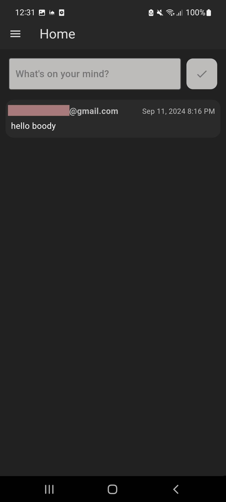
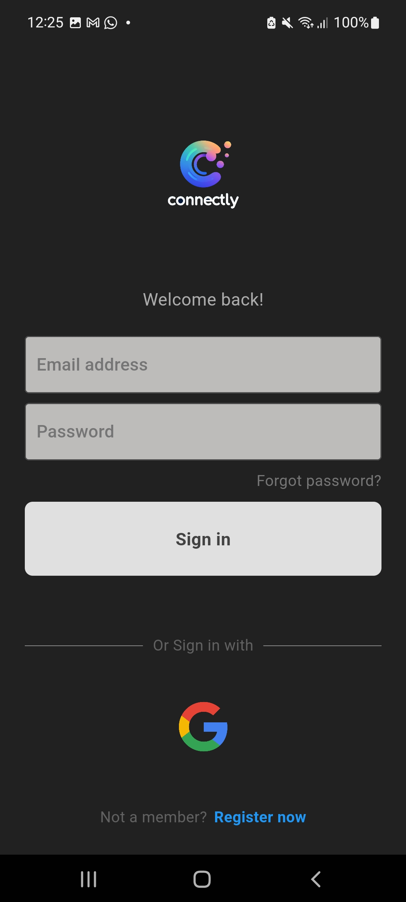
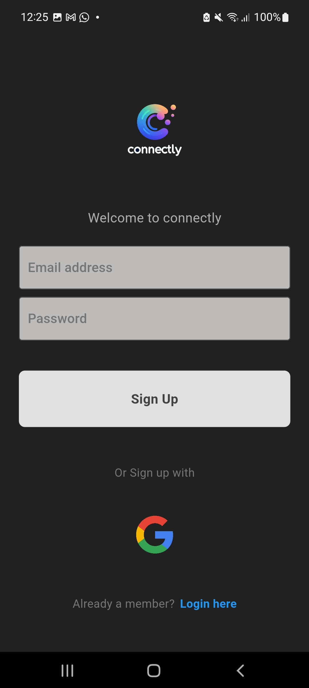
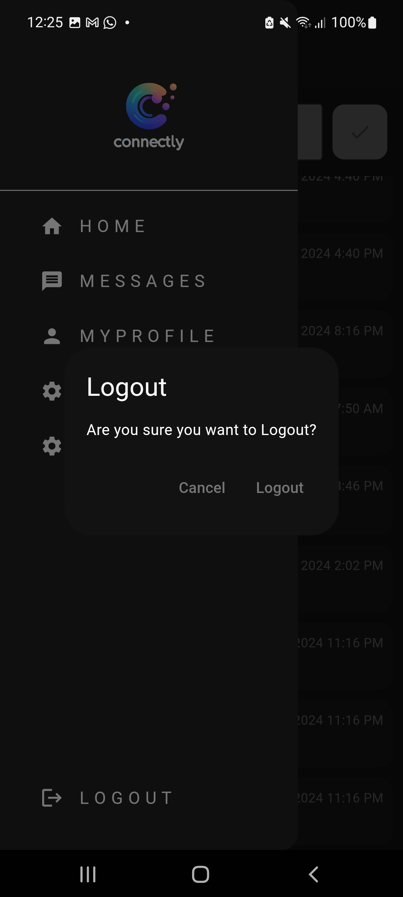
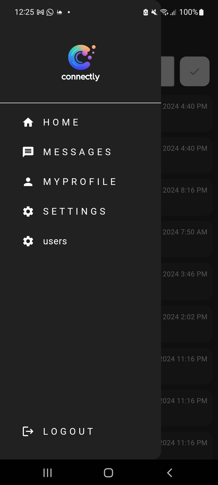

# Connectly

Connectly is a cross-platform social media application built with Flutter and Firebase. It allows users to connect, share posts, and chat in real time across Android, iOS, web, macOS, and Windows platforms.

## ✨ Features

- Firebase Authentication
- Real-time chat functionality
- Post creation and interactions
- Responsive and modern UI
- Cross-platform support (Android, iOS, web, desktop)

## 📸 Screenshots


<div style="display: flex; gap: 10px; overflow-x: auto;">

  
  
  
  
  
  

</div>

## 🚀 Getting Started

### Prerequisites

- [Flutter](https://flutter.dev/docs/get-started/install)
- Firebase project setup
- FlutterFire CLI (`dart pub global activate flutterfire_cli`)

### Installation

1. **Clone the repository:**

```
git clone https://github.com/seifddin02/connectly.git
cd connectly
```

2. **Install dependencies:**

```
flutter pub get
```

3. **Configure Firebase:**

```
flutterfire configure
```

This generates the `firebase_options.dart` file in `lib/`.

4. **Run the app:**

```
flutter run
```

## 🧾 Project Structure

- `lib/` - Main Dart source code
- `assets/` - Images and other static assets
- `android/`, `ios/`, `web/`, `macos/`, `windows/` - Platform-specific code
- `pubspec.yaml` - Dependency management
- `firebase.json` - Firebase configuration

## 🔐 Security Notes

- Make sure your Firebase Firestore/Storage rules are secure for production use.

## 📄 License

This project is licensed under the MIT License - see the [LICENSE](LICENSE) file for details.
